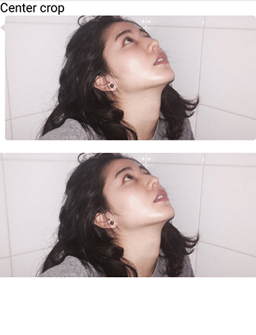
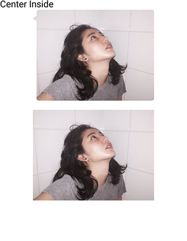
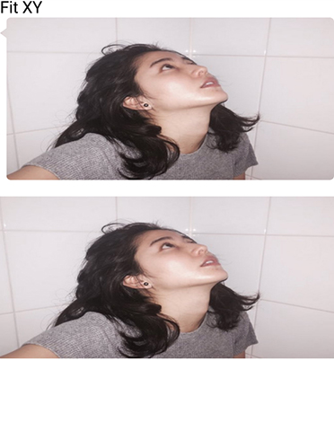
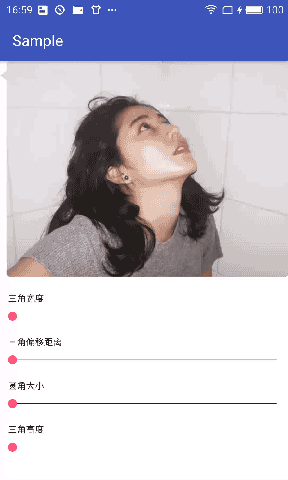
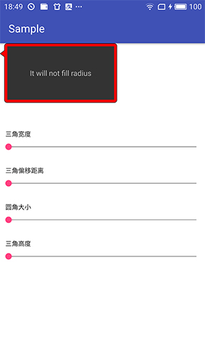

BubbleImageView and BubbleLayout
======================
**English** | [中文](README_ZH.md)

### Download

If you want to use BubbleImageView please add this code into your build.gradle:

```groovy
compile 'rouchuan.bubbleview:bubbleImageView:1.1.0'
```

If you want to use BubbleLayout:

```groovy
compile 'rouchuan.bubbleview:bubblelayout:1.1.0'
```

No other dependencies are used in both of them.BubbleImageView supports api 9 and BubbleLayout supports api 11. 

**Shadow effset only works perfectly above api 11 (include)**

### ScaleType

Working exactly same as imageView.Feel free to use all the scale types and adjustViewBounds.



### Customize

You can cutstomize all the attributes below.

| attrs          | values                | description                              |
| :------------- | --------------------- | ---------------------------------------- |
| borderColor    | color                 | color of border line                     |
| offset         | dimension             | offset of the arrow (top to bottom, left to right) |
| borderWidth    | dimension             | width of border line                     |
| radius         | dimension             | radius of corner                         |
| orientation    | left,right,top,bottom | orientation of the arrow                 |
| triangleWidth  | dimension             | width of the arrow                       |
| triangleHeight | dimension             | height of the arrow                      |
| centerArrow    | boolean               | center the arrow (it will disable offset) |
| shadowRadius   | dimension             | radius of shadow                         |
| shadowColor    | color                 | color of shadow (#8D8D8D by default)     |

### Usage



You can simply use it in xml file:

```xml
<com.ruochuan.bubbleview.BubbleImageView
        android:id="@+id/bubble"
        android:layout_width="match_parent"
        android:layout_height="wrap_content"
        android:adjustViewBounds="true"
        android:src="@drawable/masami"
        app:orientation="top"/>
```


## BubbleLayout

Use as a ViewGroup.Comparing to BubbleImageView, it add these two properties

| attrs        | values  | description      |
| ------------ | ------- | ---------------- |
| bgColor      | color   | background color |
| clipToRadius | boolean | see below        |


### Usage

It will layout all the child on top and left. If you want implement more complex layouts , please use other view group as top child.

```xml
<com.ruochuan.bubblelayout.BubbleLayout
        android:layout_width="wrap_content"
        android:layout_height="wrap_content">
        <TextView
            android:layout_width="wrap_content"
            android:layout_height="wrap_content" 
            android:text="This is a sample"/>
</com.ruochuan.bubblelayout.BubbleLayout>
```



By default, It will exclude the size of radius when measuring and layouting, if you want fill the BubbleLayout, please set clipToRadius true and set the child view a background drawable which has the same radius with its parent.

### Things to be done

1. ~~Bubble-ViewGroup~~
2. ~~Support shadow effect~~
3. Arrow angle

## License ##

    Copyright 2017 shenruochuan
    Licensed under the Apache License, Version 2.0 (the "License");
    you may not use this file except in compliance with the License.
    You may obtain a copy of the License at
    
    http://www.apache.org/licenses/LICENSE-2.0
    
    Unless required by applicable law or agreed to in writing, software
    distributed under the License is distributed on an "AS IS" BASIS,
    WITHOUT WARRANTIES OR CONDITIONS OF ANY KIND, either express or implied.
    See the License for the specific language governing permissions and
    limitations under the License.